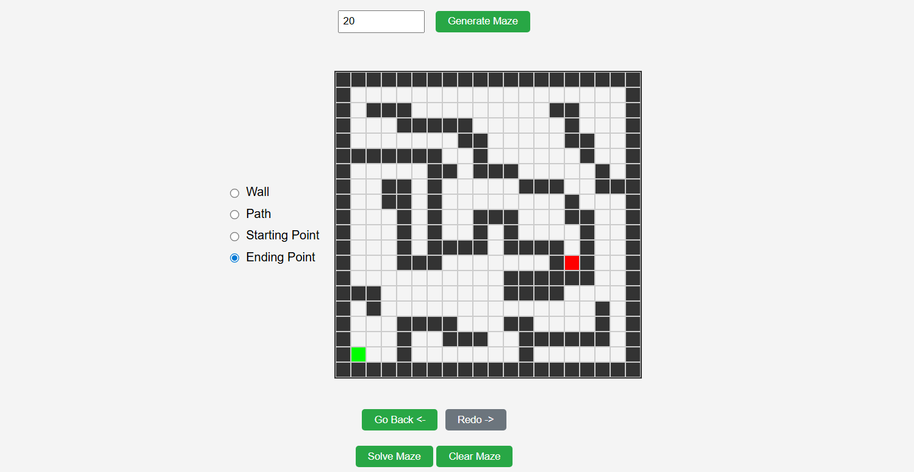
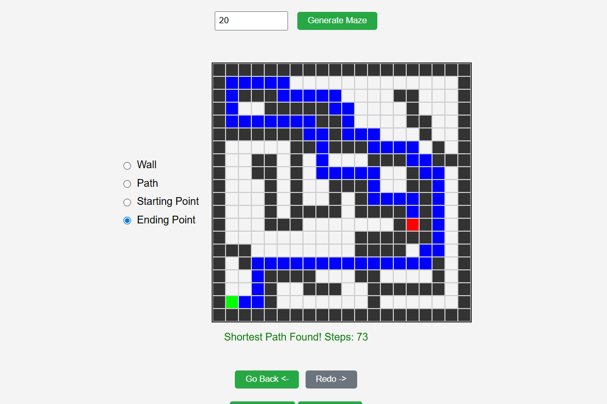

# Maze Solver

A web-based interactive maze solver that allows you to create custom mazes and find the shortest path using the **Breadth-First Search (BFS)** algorithm.

🔗 **[Live Demo](https://kareemh-1.github.io/MazeSolver/)**

## Algorithm

This maze solver uses **Breadth-First Search (BFS)**, a graph traversal algorithm that explores nodes level by level:

1. **Initialization**: Start from the starting point and mark it as visited
2. **Queue-based traversal**: Use a queue to explore cells in order
3. **Exploration**: For each cell, check all four adjacent neighbors (up, down, left, right)
4. **Path tracking**: Keep track of each cell's predecessor to reconstruct the path
5. **Termination**: Stop when the end point is reached or all reachable cells are explored
6. **Path reconstruction**: Backtrack from the end to the start using the predecessor chain

BFS guarantees finding the **shortest path** in an unweighted grid, making it ideal for maze solving.

## Features

### Interactive Maze Design
- **Customizable Grid Size**: Generate mazes from 5x5 up to 50x50
- **Drawing Modes**: 
  - Wall (obstacles)
  - Path (walkable cells)
  - Start point (green)
  - End point (red)

### Editing Tools
- **Undo/Redo**: 
  - Undo button or `Ctrl+Z` to revert changes
  - Redo button or `Ctrl+Y` to restore undone changes
  - Tracks up to 100 edits
- **Clear Maze**: Reset the entire maze while keeping the border walls

### Pathfinding
- **BFS Algorithm**: Finds the shortest path from start to end
- **Visual Solution**: Highlights the solution path in a distinct color
- **Step Counter**: Displays the number of steps in the shortest path
- **No Path Detection**: Alerts when the maze is unsolvable

## Screenshots

### Unsolved Maze

*A custom maze ready to be solved with start (green) and end (red) points marked*

### Solved Maze

*The shortest path highlighted after running the BFS algorithm*

## How to Use

1. **Set Maze Size**: Enter a number between 5-50 and click "Generate Maze" (or press Enter)
2. **Design Your Maze**: 
   - Select a drawing mode (Wall, Path, Start, or End)
   - Click or drag on cells to draw
3. **Place Start & End**: Mark exactly one start point and one end point
4. **Solve**: Click "Solve Maze" to find the shortest path
5. **View Results**: The solution path will be displayed with the total step count

## Quick Start

Simply open `index.html` in a web browser to start using the maze solver!
